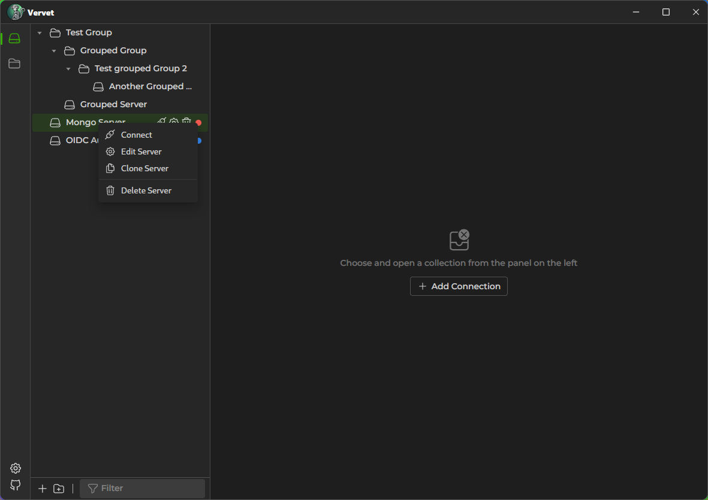
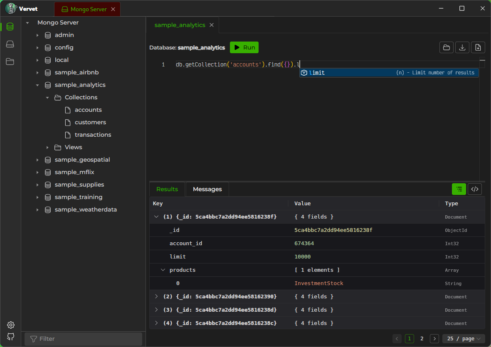
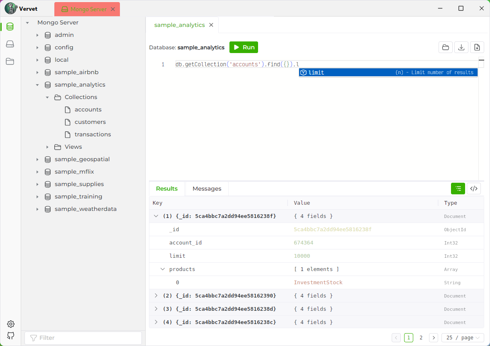
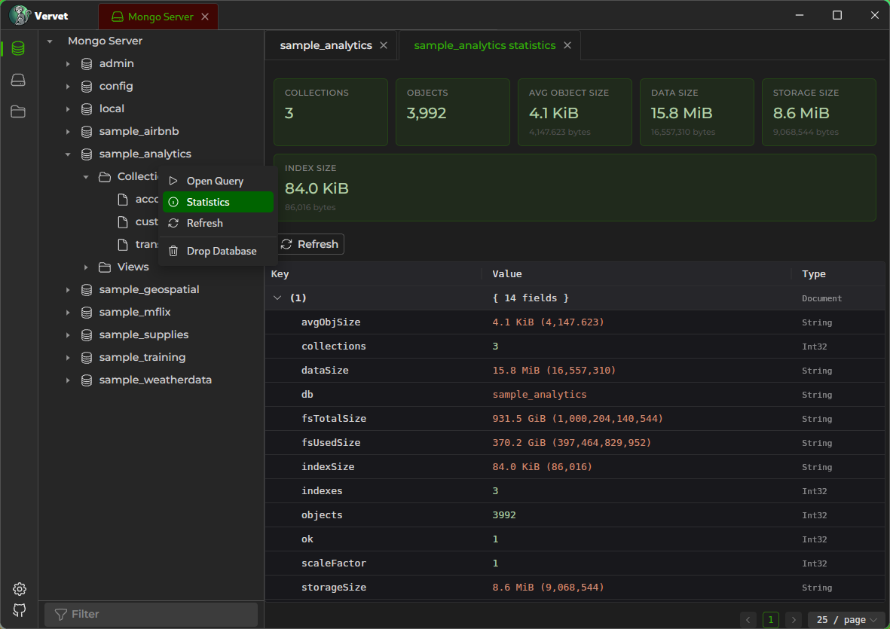

# Vervet


A desktop MongoDB explorer built with [Wails](https://wails.io), combining Go for the backend with Vue 3 and [Naive UI](https://www.naiveui.com/) for the frontend.

The UI is heavily influenced by [Tiny RDM](https://redis.tinycraft.cc/).

> **Note:** Vervet is under active development and not yet feature-complete.

## Screenshots

| Server tree | Query editor (dark) | Query editor (light) | Statistics |
|---|---|---|---|
|  |  |  |  |

## Features

- **Connection management** — connect to multiple MongoDB servers with support for connection strings stored securely in the OS keyring
- **Data browser** — navigate servers, databases, and collections in a tree view
- **Query editor** — write and execute MongoDB queries with Monaco Editor, auto-completion, and syntax highlighting
- **Results viewer** — view query results as a document tree or raw JSON
- **Index management** — create, edit, and drop indexes
- **Database & collection statistics** — view stats for databases and collections
- **Workspaces** — organise your connections and queries
- **Multi-tab interface** — work with multiple queries and views simultaneously
- **Cross-platform** — builds for Linux, macOS, and Windows

## Tech Stack

| Layer | Technology |
|---|---|
| Backend | Go, MongoDB Go Driver |
| Frontend | Vue 3, Naive UI, Monaco Editor |
| Framework | Wails v2 |
| Build | Bun, Vite |

## Getting Started

### Prerequisites

- [Go](https://go.dev/) (1.24+)
- [Bun](https://bun.sh/)
- [Wails CLI](https://wails.io/docs/gettingstarted/installation)

### Development

```bash
git clone https://github.com/blacktau/vervet.git
cd vervet
wails dev
```

This starts the Go backend and the Vite dev server together with hot-reload.

### Build

```bash
wails build
```

### Frontend commands (from `frontend/`)

```bash
bun run dev       # Vite dev server
bun run build     # Type-check + production build
bun run lint      # ESLint + vue-tsc --noEmit
bun run format    # Prettier
bun run test      # Vitest unit tests
```

### Go tests

```bash
go test ./...
```

## Downloads

Pre-built binaries are available on the [Releases](https://github.com/blacktau/vervet/releases) page for:

- **Linux** — AppImage (amd64)
- **macOS** — DMG (amd64, arm64)
- **Windows** — NSIS installer (amd64, arm64)

## License

[GPL-3.0](LICENSE.md)
