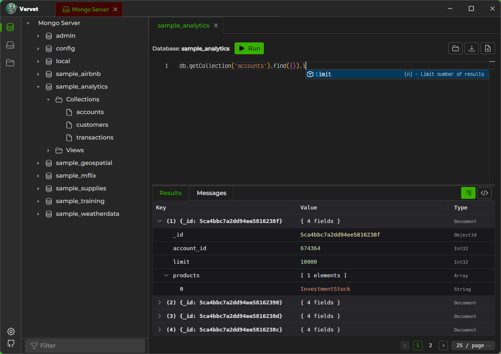
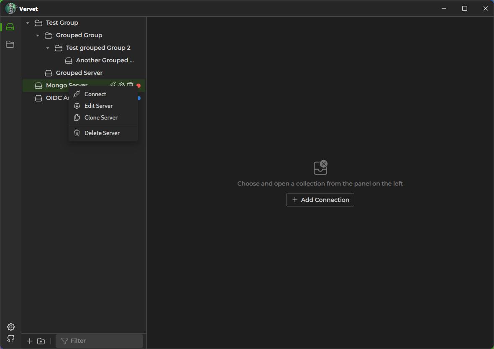
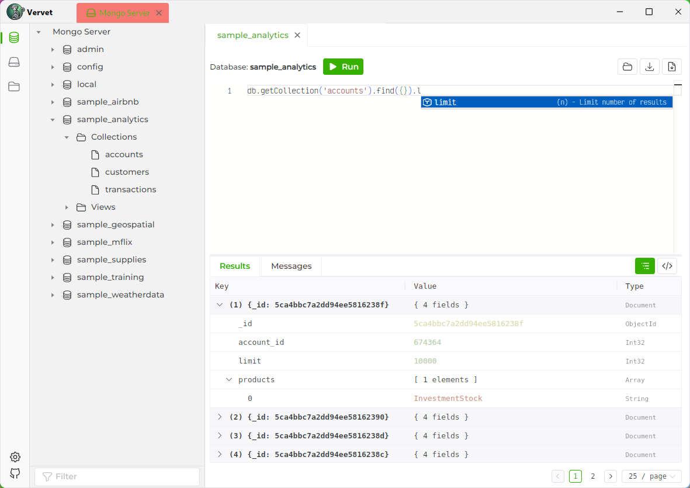
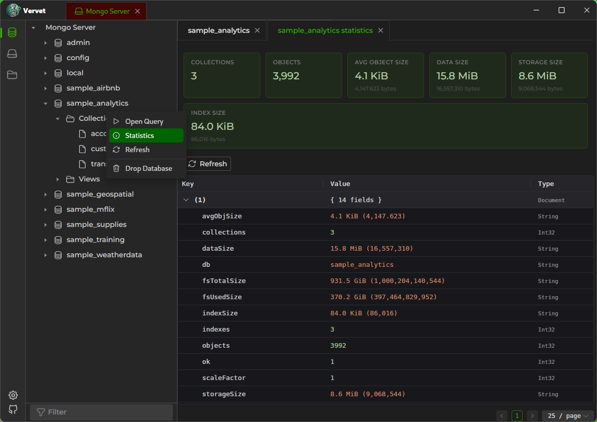

# Vervet

**A desktop MongoDB explorer.** Browse, query and manage your MongoDB servers
from a native app on Linux, macOS and Windows. No telemetry, no accounts, no
cloud.

📖 **[Documentation](https://blacktau.github.io/vervet/)** ·
⬇️ **[Download](https://blacktau.github.io/vervet/guide/install.html)** ·
🔒 **[Privacy policy](https://blacktau.github.io/vervet/privacy.html)**

> **Note:** Vervet is under active development and not yet feature-complete.

## Features

- **Connection management** — connect to multiple servers; connection strings are stored in your OS keyring, never in a config file
- **OIDC authentication** — sign in to servers that use OpenID Connect
- **Workspaces** — organise servers and saved queries
- **Data browser** — navigate servers, databases and collections in a tree view
- **Query editor** — Monaco-based, with MongoDB syntax highlighting, autocompletion and live syntax validation
- **Script runner** — run multi-statement mongosh-compatible scripts
- **Schema browser** — see a collection's inferred field types
- **Index management** — create, edit and drop indexes
- **Statistics** — database and collection statistics, including index sizes
- **Export results** — write query results out to a file
- **Multi-tab interface** — several queries and views at once
- **Cross-platform** — Linux, macOS and Windows

## Download

Grab the latest build from the [downloads page](https://blacktau.github.io/vervet/guide/install.html),
or straight from [Releases](https://github.com/blacktau/vervet/releases/latest):

| Platform | Formats |
|---|---|
| **Linux** (amd64) | AppImage, `.deb`, `.rpm` |
| **macOS** (Intel, Apple silicon) | `.dmg` |
| **Windows** (amd64, arm64) | Installer `.exe`, portable `.zip` |

## Screenshots

| Server tree | Query editor (light) | Statistics |
|---|---|---|
|  |  |  |

## Built with

Go and the MongoDB Go Driver on the backend; Vue 3, [Naive UI](https://www.naiveui.com/)
and Monaco Editor on the frontend, bundled by [Wails](https://wails.io). The UI
is heavily influenced by [Tiny RDM](https://redis.tinycraft.cc/).

## Contributing

See [CONTRIBUTING.md](CONTRIBUTING.md) for build instructions and development setup.

## Licence

[GPL-3.0](LICENSE.md)
